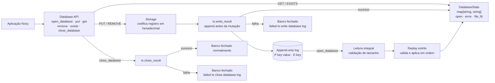

# NoxyDB

NoxyDB é um banco de dados chave-valor persistente e leve, escrito inteiramente
em Noxy. Ele implementa um mecanismo de armazenamento baseado em log somente de
acréscimo, com indexação em memória, reprodução estrita do log e tratamento
explícito de falhas de entrada e saída. Mais do que um projeto de banco de
dados, o NoxyDB funciona como uma carga de trabalho real de programação de
sistemas, criada para exercitar e orientar a evolução da linguagem Noxy, de sua
máquina virtual e de sua biblioteca padrão.

## Arquitetura



## Uso

```noxy
use noxydb

let db: noxydb.Database = noxydb.open_database("database.db")
let profile: map[string, any] = {"city": "Cuiabá"}
let user: map[string, any] = {
    "name": "Estevao",
    "age": 30,
    "active": true,
    "languages": ["Python", "Noxy"],
    "profile": profile
}

let stored: noxydb.PutResult = noxydb.put(db, "user:1", user)
if stored.success then
    let result: noxydb.LookupResult = noxydb.get(db, "user:1")
    if result.found then
        print(result.value["name"])
    end
else
    print(stored.error)
end
noxydb.close_database(db)
```

## API

NoxyDB v0.2 maps string keys to JSON objects represented as
map[string, any]. Scalars, arrays, and null are valid inside a document but not
at its root.

LookupResult contains found: bool and value: map[string, any]. PutResult
contains success: bool and error: string. An existing empty object returns
found == true; an absent key returns found == false.

put() replaces the complete document. It returns document is not
JSON-compatible for invalid caller values without failing the database. An I/O
append failure returns failed to write database log and transitions the
database to failed.

## JSON domain

Documents may contain null, bool, signed 64-bit int, finite 64-bit float,
string, arrays, and recursively string-keyed maps. Bytes, structs, references,
callables, channels, wait groups, non-string map keys, NaN, infinities, and
cycles are rejected.

## State and isolation

The authoritative in-memory state is map[string, string] containing serialized
JSON. get() deserializes a fresh map on every successful lookup. Mutating the
input after put(), or mutating a returned document, cannot change database
state or persistence.

## Physical format and replay

P<TAB><key_hex><TAB><payload_hex>\n
D<TAB><key_hex>\n

storage.nx treats payloads as opaque strings. Replay strictly validates record
termination, arity, operations, hexadecimal data, and read byte count. The API
then validates every replayed payload as a JSON object before opening the file
for append.

There is no header, migration, fallback, version discriminator, or v0.1
compatibility logic.

## Lifecycle and durability

The observable states remain open, normally closed, and failed. Writes reach
the append-only log before the raw in-memory map changes. Write and close
failures are explicit. Persistence is guaranteed after close_database()
completes successfully; crash durability and fsync are not provided.

Queries, JSON Path, partial updates, indexes, schemas, collections, filters,
compaction, TTL, networking, concurrency, transactions, replication, and
sharding remain out of scope.
