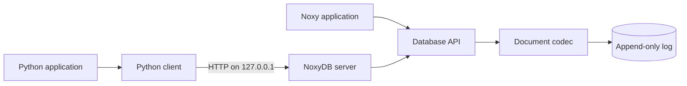

# NoxyDB

NoxyDB is a lightweight, persistent document key-value database written in
Noxy. String keys map to JSON objects stored in an append-only log.

Use it directly from a Noxy application or run the local server and connect
through the dependency-free Python client.

- Document values with nested objects, arrays, strings, numbers, booleans, and null
- Append-only persistence with strict replay validation
- Strict JSON validation and isolated values on every read
- Embedded API for Noxy applications
- Local HTTP server with one file per logical database
- Python 3.10+ client with no runtime dependencies

## Architecture



## Quick start: embedded Noxy

```noxy
use noxydb

let db: noxydb.Database = noxydb.open_database("database.db")
let profile: map[string, any] = {"city": "Cuiabá"}
let user: map[string, any] = {
    "name": "Estevao",
    "active": true,
    "languages": ["Python", "Noxy"],
    "profile": profile
}

let stored: noxydb.PutResult = noxydb.put(db, "user:1", user)
if stored.success then
    let result: noxydb.LookupResult = noxydb.get(db, "user:1")
    if result.found then
        print(result.value["name"])
    end
else
    print(stored.error)
end

noxydb.close_database(db)
```

Run the complete embedded example:

```powershell
$env:NOXY_EXE = "D:\path\to\noxy.exe"
& $env:NOXY_EXE examples/documents.nx
```

## Quick start: local server and Python

Start the server and install the Python client in editable mode:

```powershell
& "D:\path\to\noxy.exe" server/noxydb_server.nx --data-dir ./data --port 8765
python -m pip install -e ./python
```

In another terminal, connect to the server:

```python
from noxydb import NoxyDBClient

client = NoxyDBClient("http://127.0.0.1:8765")

with client.open_database("usuarios") as db:
    stored = db.put("user:1", {"name": "Estevão", "active": True})
    if not stored.success:
        raise RuntimeError(stored.error)

    result = db.get("user:1")
    if result.found:
        print(result.value["name"])

    db.remove("user:1")
```

The server creates `data/usuarios.db` when the logical database is first
opened and stays running when clients disconnect.

## Data model and API

Every value is a JSON object. Nested values may be null, booleans, signed
64-bit integers, finite 64-bit floats, strings, arrays, or string-keyed objects.
`put` replaces the complete document, and every successful `get` returns a
fresh value that can be changed without mutating database state.

| Operation | Embedded Noxy | Python client |
| --- | --- | --- |
| Open | `noxydb.open_database(path)` | `client.open_database(name)` |
| Store or replace | `noxydb.put(db, key, value)` | `db.put(key, value)` |
| Read | `noxydb.get(db, key)` | `db.get(key)` |
| Check | `noxydb.exists(db, key)` | `db.exists(key)` |
| Remove | `noxydb.remove(db, key)` | `db.remove(key)` |
| Close | `noxydb.close_database(db)` | `db.close()` |

## Examples and internals

- [Document CRUD and replay](examples/documents.nx)
- [Interactive user registry in Noxy](examples/cadastro_usuarios.nx)
- [Server-backed user registry in Python](examples/cadastro_usuarios.py)
- [How NoxyDB works](docs/noxydb-como-funciona.md)

## Operational notes

- The server listens only on `127.0.0.1` and has no authentication. It is not a
  remote database service.
- One server can manage multiple logical databases. Each name maps to an
  isolated `.db` file in the configured data directory.
- Do not open the same database file from multiple NoxyDB processes at once.
- Python `Database.close()` closes the remote client handle logically; the
  server keeps its physical database handle cached. Embedded
  `noxydb.close_database(db)` physically closes the file descriptor.
- Writes reach the append-only log before in-memory state changes. A successful
  embedded close provides persistence, but crash durability and `fsync` are not
  provided.
- Queries, partial updates, indexes, schemas, collections, compaction, TTL,
  transactions, replication, and sharding are outside the current scope.

## Tests

Run the Python client unit tests without a Noxy runtime:

```powershell
pwsh -File tests/run_tests.ps1 -Group python
```

Run the complete embedded, server, and Python unit suite:

```powershell
$env:NOXY_EXE = "D:\path\to\noxy.exe"
pwsh -File tests/run_tests.ps1
```

Run the Python-to-server integration suite:

```powershell
$env:NOXY_EXE = "D:\path\to\noxy.exe"
pwsh -File tests/run_tests.ps1 -Group integration
```
