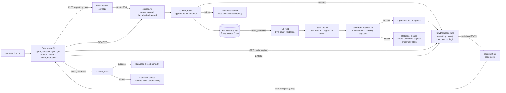

# NoxyDB

NoxyDB is a lightweight, persistent key-value database written entirely in
Noxy. Each `string` key identifies a JSON document that may contain strings,
numbers, booleans, null values, arrays, and nested objects. Documents are stored
in an append-only log and retrieved, replaced, or removed by key.

Beyond being a database project, NoxyDB serves as a real-world systems
programming workload designed to exercise and guide the evolution of the Noxy
language, its virtual machine, and its standard library.

## Architecture



## Usage

```noxy
use noxydb

let db: noxydb.Database = noxydb.open_database("database.db")
let profile: map[string, any] = {"city": "Cuiabá"}
let user: map[string, any] = {
    "name": "Estevao",
    "age": 30,
    "active": true,
    "languages": ["Python", "Noxy"],
    "profile": profile
}

let stored: noxydb.PutResult = noxydb.put(db, "user:1", user)
if stored.success then
    let result: noxydb.LookupResult = noxydb.get(db, "user:1")
    if result.found then
        print(result.value["name"])
    end
else
    print(stored.error)
end
noxydb.close_database(db)
```

## NoxyDB Server

```powershell
# Start a persistent local server, even when no database exists yet
& "D:\path\to\noxy.exe" server\noxydb_server.nx --data-dir .\data --port 8765

# Install the Python client during development
python -m pip install -e .\python
```

```python
from noxydb import NoxyDBClient

client = NoxyDBClient("http://127.0.0.1:8765")
db = client.open_database("usuarios")
db.put("user:1", {"name": "Estevão", "active": True})

result = db.get("user:1")
if result.found:
    print(result.value["name"])

db.remove("user:1")
db.close()
```

The server creates `data/usuarios.db` the first time `usuarios` is opened and
remains running when no clients are connected. A single server manages multiple
database names, with one isolated `.db` file per name. NoxyDB maps keys directly
to documents; it has no tables or collections.

Each completed request is printed to the server console with its local timestamp,
HTTP method and route, database name, key when applicable, response status, and
duration. Keys are JSON-escaped so they cannot inject extra log lines. Document
contents are never logged:

```text
2026-08-13T14:32:10 POST /v1/open database=usuarios status=200 duration_ms=1
2026-08-13T14:32:11 POST /v1/put database=usuarios key="user:1" status=200 duration_ms=2
2026-08-13T14:32:11 POST /v1/get database=usuarios key="user:1" status=200 duration_ms=0
```

The server accepts connections only on `127.0.0.1`. It has no authentication
because it is local-only. Do not share a database's `.db` file with another
NoxyDB process concurrently.

Each connection has a 1,000 ms read-idle deadline and a finite absolute
deadline. The absolute allowance is 1,000 ms plus 1 ms per 32 possible request
bytes (about 33.8 seconds at the 1 MiB limit); after valid headers expose a
smaller declared body, it is shortened to the corresponding remaining size.
This stable size allowance accommodates the runtime's byte-safe polling path
without letting a slow client keep a handler indefinitely. A timed-out client
receives a JSON `400 Bad Request` response and its socket is closed.
NoxyDB serializes each poll-and-receive pair through a server-local semaphore
because the current runtime's polling buffer is not safe for concurrent map
writes; 10 ms poll slices prevent a stalled client from monopolizing it.
After the declared body is complete, the server performs one immediate
readiness probe (`net_select` with a requested zero timeout; the current Noxy
runtime applies its 1 ms minimum) and rejects any surplus bytes already
available before routing. It does not wait for EOF because HTTP clients wait
for the response. Bytes that arrive only after that probe cannot be detected
without adding a grace wait to every request; such later bytes are discarded
when this one-request-per-connection server closes the socket.

`Database.close()` in the Python client is a logical remote close: it closes
that client handle, while the server retains the physical database handle in
its cache. It is therefore different from embedded Noxy
`noxydb.close_database(db)`, which physically closes the file descriptor and
reports any close failure.

## Executable example

The complete walkthrough in `examples/documents.nx` demonstrates nested
documents, reads, full replacement, removal, and replay:

```powershell
$env:NOXY_EXE = "D:\path\to\noxy.exe"
& $env:NOXY_EXE examples/documents.nx
```

The example recreates `examples/noxydb_v02.db` on every run and keeps the file
available for inspection afterward. Databases generated inside `examples/`
are ignored by Git.

### Interactive user registry

`examples/cadastro_usuarios.py` ports the original SQLite user registry to the
server-backed Python client. Each user has a dedicated key, while
`usuarios:meta` stores the next ID and the index used for listing.

Start the local server in another terminal, then run the Python port:

```powershell
& $env:NOXY_EXE server/noxydb_server.nx --data-dir .\data --port 8765
python examples/cadastro_usuarios.py
```

The Python example opens the logical database `usuarios`, stored by the server
as `data/usuarios.db`. The embedded Noxy version remains available for
comparison and stores its database at `examples/usuarios.db`:

```powershell
& $env:NOXY_EXE examples/cadastro_usuarios.nx
```

Both generated database files are ignored by Git.

## API

NoxyDB v0.2 maps string keys to JSON objects represented as
map[string, any]. Scalars, arrays, and null are valid inside a document but not
at its root.

LookupResult contains found: bool and value: map[string, any]. PutResult
contains success: bool and error: string. An existing empty object returns
found == true; an absent key returns found == false.

put() replaces the complete document. It returns document is not
JSON-compatible for invalid caller values without failing the database. An I/O
append failure returns failed to write database log and transitions the
database to failed.

## JSON domain

Documents may contain null, bool, signed 64-bit int, finite 64-bit float,
string, arrays, and recursively string-keyed maps. Bytes, structs, references,
callables, channels, wait groups, non-string map keys, NaN, infinities, and
cycles are rejected.

## State and isolation

The authoritative in-memory state is map[string, string] containing serialized
JSON. get() deserializes a fresh map on every successful lookup. Mutating the
input after put(), or mutating a returned document, cannot change database
state or persistence.

## Physical format and replay

P<TAB><key_hex><TAB><payload_hex>\n
D<TAB><key_hex>\n

storage.nx treats payloads as opaque strings. Replay strictly validates record
termination, arity, operations, hexadecimal data, and read byte count. The API
then validates every replayed payload as a JSON object before opening the file
for append.

There is no header, migration, fallback, version discriminator, or v0.1
compatibility logic.

## Lifecycle and durability

For the embedded API, the observable states remain open, normally closed, and
failed. Writes reach the append-only log before the raw in-memory map changes.
Write and physical-close failures are explicit. Persistence is guaranteed
after embedded `noxydb.close_database(db)` completes successfully; crash
durability and `fsync` are not provided.

The current Noxy runtime exposes no signal handling to this server.
`serve_local` retains its existing cleanup path: if it returns, the command
channel closes and the worker physically closes every cached database. Ctrl-C,
Task Manager termination, and other process termination are abrupt, do not run
that physical-close path, and retain the same crash-durability limitations.
The append-only log can be replayed on restart, subject to the documented
limitations above.

Queries, JSON Path, partial updates, indexes, schemas, collections, filters,
compaction, TTL, remote networking, transactions, replication, and sharding
remain out of scope.
