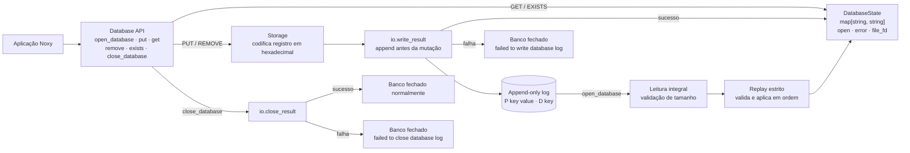

# NoxyDB

NoxyDB é um banco de dados chave-valor persistente e leve, escrito inteiramente
em Noxy. Ele implementa um mecanismo de armazenamento baseado em log somente de
acréscimo, com indexação em memória, reprodução estrita do log e tratamento
explícito de falhas de entrada e saída. Mais do que um projeto de banco de
dados, o NoxyDB funciona como uma carga de trabalho real de programação de
sistemas, criada para exercitar e orientar a evolução da linguagem Noxy, de sua
máquina virtual e de sua biblioteca padrão.

## Arquitetura



## Uso

```noxy
use noxydb

let db: noxydb.Database = noxydb.open_database("database.db")
if !noxydb.is_open(db) then
    print(noxydb.database_error(db))
else
    noxydb.put(db, "language", "Noxy")
    noxydb.put(db, "author", "Estevao")

    let result: noxydb.LookupResult = noxydb.get(db, "language")
    if result.found then
        print(result.value)
    end

    noxydb.remove(db, "author")
    noxydb.close_database(db)
end
```

Em outro processo:

```noxy
use noxydb

let db: noxydb.Database = noxydb.open_database("database.db")
let result: noxydb.LookupResult = noxydb.get(db, "language")
if result.found then
    print(result.value) // Noxy
end
noxydb.close_database(db)
```

## API

```noxy
open_database(path: string) -> Database
put(db: Database, key: string, value: string) -> void
get(db: Database, key: string) -> LookupResult
remove(db: Database, key: string) -> void
exists(db: Database, key: string) -> bool
close_database(db: Database) -> void
is_open(db: Database) -> bool
database_error(db: Database) -> string
```

`LookupResult` distingue ausência de valor vazio:

```noxy
struct LookupResult
    found: bool
    value: string
end
```

- chave existente com valor vazio: `LookupResult(true, "")`;
- chave inexistente: `LookupResult(false, "")`.

Chaves vazias também são válidas. `exists()` é uma conveniência; `get()` já
retorna existência e valor em uma única chamada.

## Estados e erros

O banco possui três estados observáveis:

- `is_open(db) == true` e erro vazio: aberto;
- fechado e erro vazio: fechado normalmente;
- fechado e erro não vazio: falhou e rejeita operações posteriores.

Erros possíveis na v0.1:

```text
failed to read database log
truncated database log
invalid database log record
failed to open database log for append
failed to write database log
failed to close database log
```

Uma falha de escrita não altera o map. Ela fecha logicamente o banco e impede
novas operações. `close_database()` é idempotente.

## Formato do log

Cada registro textual termina obrigatoriamente em `\n`. Chaves e valores UTF-8
são codificados em hexadecimal:

```text
P<TAB><chave em hex><TAB><valor em hex>\n
D<TAB><chave em hex>\n
```

Exemplo:

```text
P	6c616e6775616765	4e6f7879
P	76657273696f6e	31
P	76657273696f6e	32
D	617574686f72
```

O replay é estrito. Uma última linha sem `\n`, uma operação desconhecida,
quantidade errada de campos ou hexadecimal inválido impede a abertura. A v0.1
não ignora, repara nem trunca registros inválidos.

Antes do replay, o tamanho lido em bytes deve coincidir com `io.stat().size`.
Uma leitura curta é tratada como `failed to read database log`, nunca como um
log completo. Isso pressupõe o modelo single-process da v0.1, sem alteração
externa concorrente do arquivo.

## Durabilidade e escopo

A garantia da v0.1 é persistência após `close_database()` completar com
sucesso. A versão não executa `fsync` e não promete crash durability.

Também ficam fora da v0.1: servidor, múltiplos processos simultâneos,
concorrência, transações, replicação, sharding, índices, TTL, autenticação,
compaction, checksums e valores estruturados.

## Testes

No PowerShell, aponte o runner para um executável Noxy que contenha as APIs de
I/O observável:

```powershell
$env:NOXY_EXE = "D:\caminho\para\noxy.exe"
./tests/run_tests.ps1
```

`NOXY_EXE` é obrigatório. O runner não usa automaticamente outro checkout da
Noxy, evitando testar por engano um executável sem a evolução de I/O requerida.

Cada writer/reader de persistência roda em um processo Noxy separado. A suíte
cobre API em memória, sobrescritas, valor vazio, múltiplas chaves, tombstones,
históricos repetidos, banco vazio, falhas reais de escrita/fechamento e logs
inválidos.

## Estrutura

```text
noxydb/noxydb.nx   API e estado do banco
noxydb/storage.nx  formato, append e replay
tests/             testes Noxy e runner PowerShell
docs/              design e plano de implementação
```

A Noxy atual não possui visibilidade privada para declarações de módulo.
Consequentemente, `storage`, seus helpers e os campos de `DatabaseState` são
acessíveis tecnicamente; eles são internos por convenção. Consumidores devem
usar somente a API documentada para preservar os invariantes do banco.
